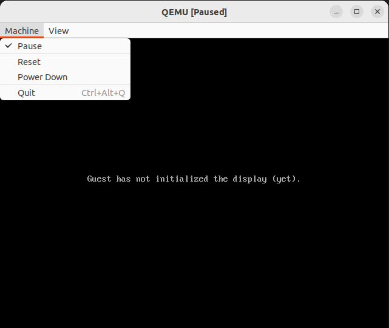
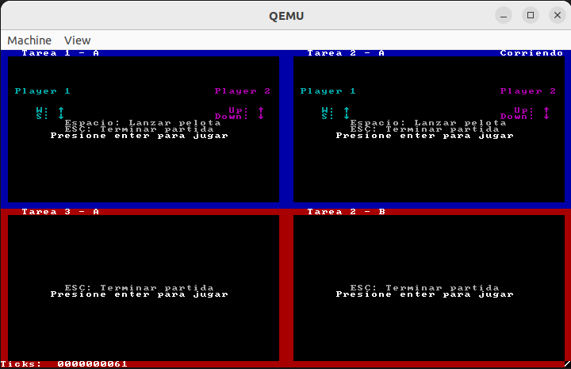
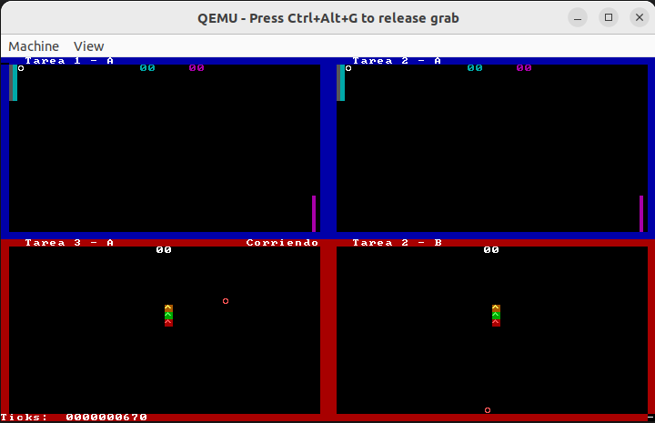
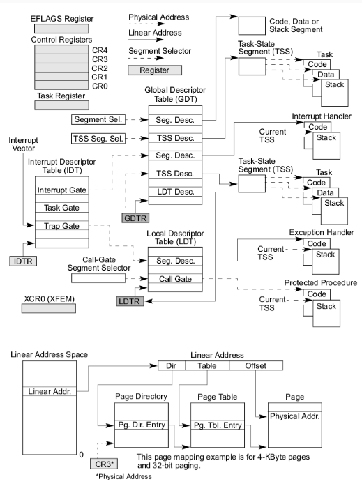

## KERNEL

El kernel fue construido con ayuda del [manual de Intel](https://www.intel.com/content/www/us/en/content-details/782158/intel-64-and-ia-32-architectures-software-developer-s-manual-combined-volumes-1-2a-2b-2c-2d-3a-3b-3c-3d-and-4.html) y fue principalmente desarrollado en assembler y en C. Puede ejecutar programas y tareas sencillas (en este caso, juegos).

### ¿COMO EJECUTAR EL PROGRAMA?

**REQUISITOS**: Vamos a utilizar como entorno de pruebas el programa **QEMU** (emulador de x86).
Este nos permite simular el arranque de una computadora IBM-PC compatible. 
Para instalar Qemu en linux correr: ` $ sudo apt-get qemu-system-i386`
Para instalarlo en Windows seguir los pasos del siguiente link:  [QEMU Windows](https://linuxhint.com/qemu-windows/)

Ejecutar en la terminal: 

 ``` sh
 $ make gdb
 ```
 Esto abrira lo siguiente:
 
 
 
 Luego, seleccionar *Machine* y en la pestaña tocar *pause* para desactivar su estado de pausa.
 
 
 
 Una vez aca, presionar la tecla *Enter* para poder ver e interactuar con las 4 tareas.
 Dos de ellas pertenecen al clasico juego de Ping Pong, mientras que los otros dos al clasico juego de la serpiente.
 
 
 
 Para el juego de Ping Pong tocar el *espacio* para lanzar la pelota, y para moverse un jugador debe usar las teclas *w* y *s*,  y el otro las flechas de arriba y abajo.
 Para el juego de la serpiente se usa solamente las flechas.
 Si se quiere salir, presionar * Ctrl +Alt + G *,pausar el juego, cerrar la pestaña y en la terminal poner *q*

### ARCHIVOS

Este trabajo fue repartido en 4 etapas, a continuacion los archivos que se usaron en cada una

1) **Segmentación y Pasaje a Modo Protegido**
   
En esta etapa deshabilitamos las interrupciones; completamos la GDT en memoria; cargamos la direccion de la GDT en el registro del procesador GDTR; habilitamos el modo protegido del procesador; hicimos un jpm far al segmento de codigo nivel 0; cargamos los selectores de segmentos restantes e hicimos el paso de Modo Real al Modo Protegido.

+ **Makefile**: encargado de compilar y generar la imagen del floppy disk.
+ **diskette.img.bz2**: la imagen del floppy que contiene el boot-sector preparado para cargar el kernel.
+ **kernel.asm**: esquema básico del código para el kernel.
+ **defines.h**, **colors.h**: constantes y definiciones.
+ **gdt.h**, **gdt.c**: definición de la tabla de descriptores globales.
+ **screen.h**, **screen.c**: rutinas para pintar la pantalla.
+ **a20.asm**: rutinas para habilitar y deshabilitar A20.
+ **print.mac**: macros útiles para imprimir por pantalla y transformar valores.
+ **kassert.h**: rutinas para garantizar invariantes en el kernel.
+ **i386.h**: funciones auxiliares para utilizar assembly desde C.
+ **types.h**: Declaración de tipos comunes en el kernel.

2) **Interrupciones**
   
Definimos la tabla de interrupciones (IDT); implementamos dos rutinas de atención de interrupción: la correspondiente al reloj y al teclado, y dos syscalls de nivel de usuario

+ **pic.c**, **pic.h**: funciones pic_enable, pic_disable, pic_finish1 y pic_reset.
+ **isr.h**, **isr.asm**: rutinas de atención de interrupciones
+ **idt.h**, **idt.c**: definición de la tabla de interrupciones
+ **keyboard_input.h**, **keyboard_input.c**: funciones para procesar los datos leídos del controlador de teclado
+ **orga2.py**: archivos extra para ayudar el debugging con gdb/qemu

3) **Paginacion**
   
Inicializamos y habilitamos los mecanismos de manejo de memoria de nuestro kernel

+ **mmu.c**: Definicion de funciones del manejador de memoria
+ **mmu.h**: Declaracion de funciones del manejador de memoria

4) **Tareas**
   
Definimos las estructuras de las tareas disponibles para ser ejecutadas; armamos un scheduler que determine la tarea a la que le toca ejecutase en un período de tiempo, y el mecanismo para el intercambio de tareas de la CPU; e iniciamos el kernel con una tarea inicial y colocamos una tarea idle para cuando no haya tareas en ejecución.

+ **idle.asm**: código de la tarea Idle.
+ **shared.h**: estructura de la página de memoria compartida
+ **tareas/syscall.h**: interfaz para realizar llamadas al sistema desde las tareas
+ **tareas/task_lib.h**: Biblioteca con funciones útiles para las tareas
+ **tareas/task_prelude.asm**: Código de inicialización para las tareas
+ **tareas/taskPong.c**, **tareas/taskGameOfLife.c**, **tareas/taskSnake.c**, **tareas/taskTipear.c**,**tareas/taskPongScoreboard.**  : código de las tareas  
+ **tss.h**, **tss.c**: definición de estructuras y funciones para el manejo de las TSSs
+ **sched.h**, **sched.c**: scheduler del kernel
+ **tasks.h**, **tasks.c**: Definición de estructuras y funciones para la administración de tareas
+ **task_defines.h**: Definiciones generales referente a tareas

### ESQUEMA



