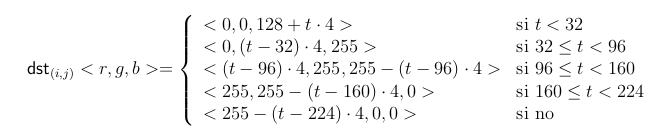

## Simulacion de un mapa de calor

Simulacion de un mapa de calor empleando instrucciones **SIMD**, hecho con assembler, python y C 
####Como correr los tests?
1.  Poner en la terminal
```sh
	make
```
Para ejecutar el Makefile principal, este ejecutara a la vez el Makefile que se encuentra en los archivo de Filters y Helpers. Guarda todo en la carpeta Build

2. Dirigirse al archivo Tests y ejecutar secuencialmente en la terminal:
```sh
	python3 1_generar_imagenes.py
```
Genera diferentes tamaños de las imagenes que se encuentran en el archivo data para testear, ademas de las carpetas donde se guardaran los resultados que se deben devolver (Resultados_catedra) y los que se devolvieron (Resultados_nuestros). Para que este script funcione correctamente se requiere la utilidad convert que se encuentra en la biblioteca imagemagick. Luego:
```sh
	python3 2_tests_diff_cat_asm.py
``` 
Genera los resultados que se deben devolver y los compara con los que se devolvieron. En la carpeta Resultados_nuestros se pueden ver los resultados. Y por ultimo
```sh
 	./3_correr_test_mem.sh"
 ```
 Corre los test de memoria

####PRELIMINARES
Consideramos a una imagen como una matriz de pı́xeles. Cada pı́xel está determinado por cuatro componentes: los colores azul(b), verde (g) y rojo (r), y la transparencia (a). En nuestro caso particular cada una de estas componentes tendrá 8 bits (1 byte) de profundidad, es decir, estarán representadas por números enteros en el rango [0, 255].
Nombraremos a las matrices de pı́xeles *src* como la imagen de entrada y como *dst* a la imagen destino. Ambas serán almacenadas por filas, tomando el pı́xel [0,0] de la matriz como el pixel arriba a la izquierda de la imagen. Los filtros reciben un puntero a la imagen que apunta al pixel de arriba a la izquierda y se la recorre izquierda a derecha, arriba a abajo, avanzando la dirección de memoria del puntero.
En todos los filtros, el valor de la componente de transparencia debe ser 255.

####TEMPERATURA
El filtro temperatura toma una imagen fuente y genera un efecto que simula un mapa de calor. El filtro toma los tres componentes del cada pixel, los suma y divide por 3, y califica a eso como la temperatura t
>T(i,j) = (src.r(i,j) + src.g(i,j) + src.b(i,j))/3

En función de la temperatura, se determina el color en la imagen destino. La temperatura se trunca y se guarda en una variable de tipo entero.



####ARCHIVOS Y USO
+ **build**: Los archivos objeto y ejecutables
+ **filters**: Las implementaciones del filtro de temperatura
+ **helper**: Los fuentes de la biblioteca BMP y de la herramienta de comparación de imágenes.
+ **img**: Algunas imágenes de prueba.
+ **test**: Scripts para realizar tests y uso de la memoria

####CODIGO

Las imágenes se almacenan en memoria en color, en el orden **B** (blue), **G** (green), **R** (red), **A** (alpha).
Los parametros de la funcion de temperatura son:
+ **src** : Es el puntero al inicio de la matriz de elementos de 32 bits sin signo (el primer byte corresponde al canal azul de la imagen (B), el segundo el verde (G), el tercero el rojo (R), y el cuarto el alpha (A)) que representa a la imagen de entrada. Es decir, como la imagen está en color, cada pı́xel está compuesto por 4 bytes.
+ **dst** : Es el puntero al inicio de la matriz de elementos de 32 bits sin signo que representa a la imagen de salida.
+ **height** : Representa el alto en pı́xeles de la imagen, es decir, la cantidad de filas de las matrices de entrada y salida.
+ **width** : Representa el ancho en pı́xeles de la imagen, es decir, la cantidad de columnas de las matrices de entrada y salida.
+ **src row size** : Representa el ancho en bytes de cada fila de la imagen fuente incluyendo el padding en caso de que hubiese. Es decir, la cantidad de bytes que hay que avanzar para moverse a la misma columna de fila siguiente o anterior.
+ **dst row size** : Representa el ancho en bytes de cada fila de la imagen destino incluyendo el padding en caso de que hubiese. Es decir, la cantidad de bytes que hay que avanzar para moverse a la misma columna de fila siguiente o anterior

####FORMATO BMP

El formato BMP es uno de los formatos de imágenes más simples: tiene un encabezado y un mapa de bits que representa la información de los pı́xeles.
Aca se utilizará una biblioteca para operar con archivos en ese formato. Si bien esta biblioteca no permite operar con archivos con paleta, es posible leer tres tipos de formatos, tanto con o sin transparencia. Ambos formatos corresponden a los tipos de encabezado: BITMAPINFOHEADER (40 bytes), BITMAPV3INFOHEADER (56 bytes) y BITMAPV5HEADER (124 bytes).